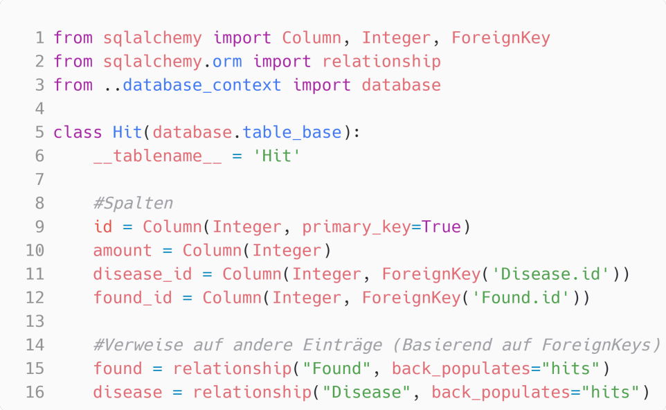
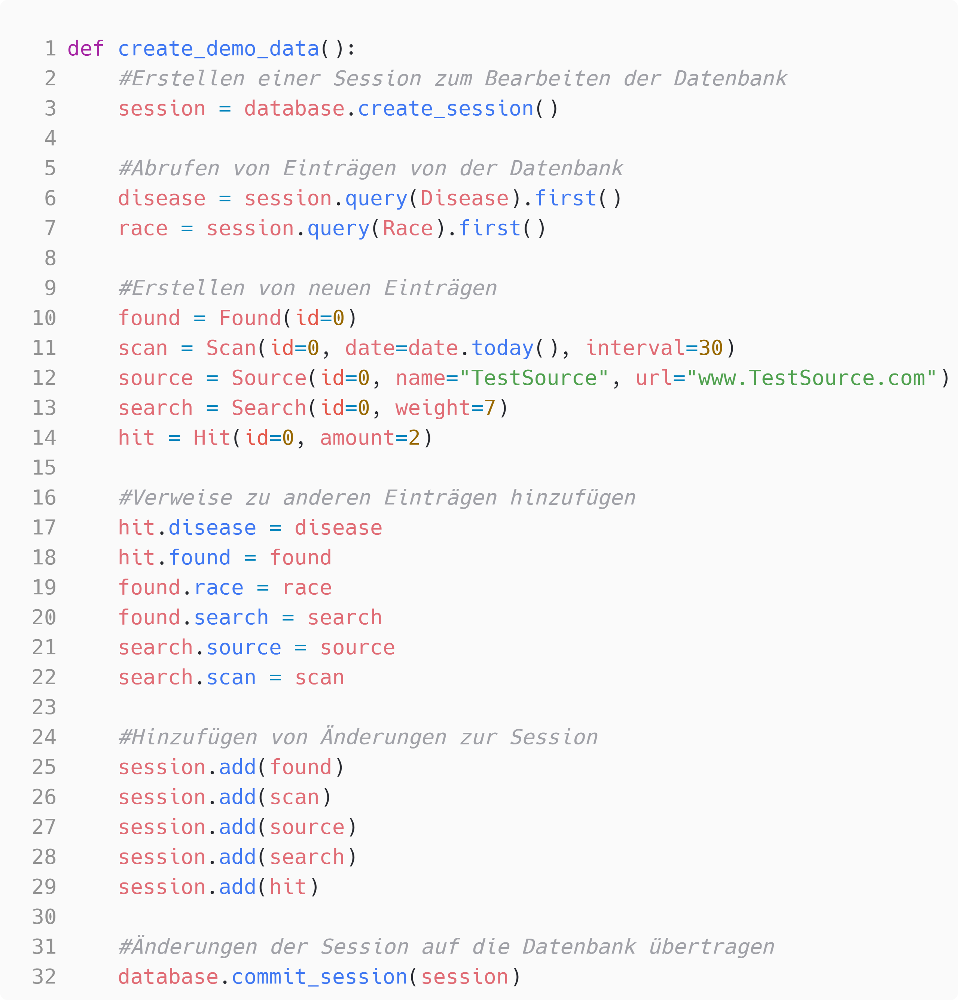

# Technische Dokumentation

## Verwendete Technologien
<ul>
    <li>Python</li>
    <li>SQLite</li>
    <li>SQLAlchemy</li>
</ul>

## Datenbankschema

###  Datengrundlage:
Von Hand angelegte Tabellen deren Daten vom Programm zur Ausführung genutzt werden.

###  Programmdaten:
Vom Programm angelegte Tabellen in denen das Programm die Ergebnisse hinterlegt.

## Erklärung
Bei jedem Durchlauf des Programmes wird ein Eintrag in der <em>Scan</em>-Tabelle angelegt mit dem
aktuellen Datum und dem Suchintervall für das Programm. Das Suchintervall kann zum Beispiel ein
Wert von 90 Tagen haben, wodurch das Programm bei dem Scan nur die Daten aus diesem Intervall
mit in das Ergebnis mit einbezieht. 

Ein Scan durchsucht dann jede Quelle in der <em>Source</em>-Tabelle und legt dafür jeweils einen Eintrag in der
<em>Search</em>-Tabelle an. Der <em>Search</em>-Eintrag kann dabei einen Gewichtungswert enthalten, falls bestimmte
Quellen mehr in das Endergebnis einfließen sollen als andere. 

Bei der Suche in einer Quelle wird für jede darin gefundene Rasse aus der <em>Race</em>-Tabelle ein Eintrag in der <em>Found</em>-Tabelle angelegt. Für die jeweils im <em>Found</em>-Eintrag hinterlegte Rasse, wird für jede gefundenen Krankheit aus der <em>Disease</em>-Tabelle ein Eintrag in der <em>Hit</em>-Tabelle angelegt mit der Anzahl der gefundenen Vorkommen der Krankheit bei dieser Rasse. 

Die beiden Tabellen <em>RaceName</em> und <em>DiseaseName</em> halten die eigentlichen Namen der Tabellen <em>Race</em> und <em>Disease</em>, da es für viele Rassen und Krankheiten mehrere Bezeichnungen gibt. Die Tabellen <em>Race</em> und <em>Diesase</em> gruppieren diese Namen also eigentlich nur über die Id.

## Schnittstelle zur Datenbank
Als Schnittstelle zur Datenbank wird die Objektrelationale Abbildung von <em>SQLAlchemy</em> genutzt. Es gibt
unter <em>/main</em> die Datei <em>database_context.py</em>, welche die Verbindung zur Datenbank herstellt und
unter <em>/main/models</em> mehrere Modellklassen, welche die Datenbanktabellen nachstellen. Diese
Modellklassen ermöglichen es mit den Tabellen aus der Datenbank als Python-Objekte zu arbeiten
und beinhalten Variablen für die Werte in den Spalten, sowie Verweise auf andere Einträge die in
Beziehung stehen.

### Beispiele
#### Die Modellklasse der Hit-Tabelle:

#### Einträge von der Datenbank abrufen und neu hinzufügen

