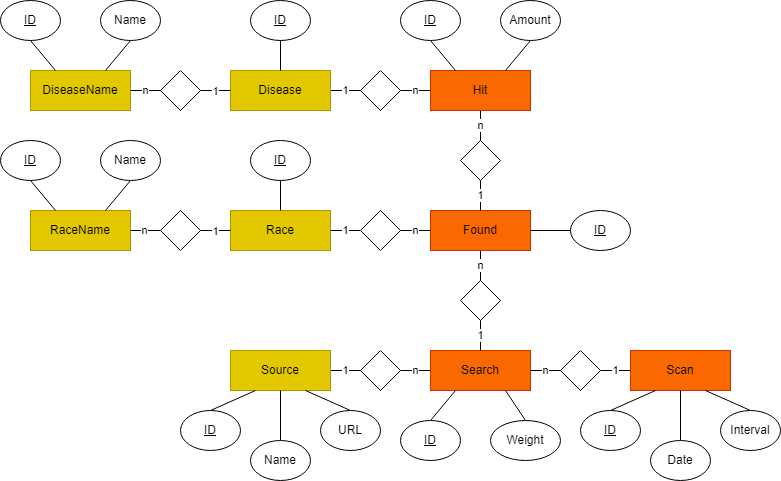

# Technische Dokumentation

## Verwendete Technologien
<ul>
    <li>Python</li>
    <li>SQLite</li>
    <li>SQLAlchemy</li>
</ul>

## Abhängigkeiten
### Programm
```console
pip install sqlalchemy
```
### Google Trends Crawler
```console
pip install pytrends
```
### Pferd.de Crawler
```console
pip install requests
pip install beautifulsoup4
```

## Datenbankschema



###  Datengrundlage:
Von Hand angelegte Tabellen deren Daten vom Programm zur Ausführung genutzt werden. Diese tabellen werden über die Skripts in <em>/main/database/scripts/</em> mit Daten befüllt.

###  Programmdaten:
Vom Programm angelegte Tabellen in denen das Programm die Ergebnisse hinterlegt.

## Erklärung
Bei jedem Durchlauf des Programmes wird ein Eintrag in der <em>Scan</em>-Tabelle angelegt mit dem
aktuellen Datum und dem Suchintervall für das Programm. Das Suchintervall kann zum Beispiel ein
Wert von 90 Tagen haben, wodurch das Programm bei dem Scan nur die Daten aus diesem Intervall
mit in das Ergebnis mit einbezieht.<br>

Ein Scan durchsucht dann jede Quelle in der <em>Source</em>-Tabelle und legt dafür jeweils einen Eintrag in der
<em>Search</em>-Tabelle an. Der <em>Search</em>-Eintrag kann dabei einen Gewichtungswert enthalten, falls bestimmte
Quellen mehr in das Endergebnis einfließen sollen als andere.<br>

Bei der Suche in einer Quelle wird für jede darin gefundene Rasse aus der <em>Race</em>-Tabelle ein Eintrag in der <em>Found</em>-Tabelle angelegt. Für die jeweils im <em>Found</em>-Eintrag hinterlegte Rasse, wird für jede gefundenen Krankheit aus der <em>Disease</em>-Tabelle ein Eintrag in der <em>Hit</em>-Tabelle angelegt mit der Anzahl der gefundenen Vorkommen der Krankheit bei dieser Rasse.<br>

Die beiden Tabellen <em>RaceName</em> und <em>DiseaseName</em> halten die eigentlichen Namen der Tabellen <em>Race</em> und <em>Disease</em>, da es für viele Rassen und Krankheiten mehrere Bezeichnungen gibt. Die Tabellen <em>Race</em> und <em>Diesase</em> gruppieren diese Namen also eigentlich nur über die Id.

## Schnittstelle zur Datenbank
Als Schnittstelle zur Datenbank wird die Objektrelationale Abbildung von <em>SQLAlchemy</em> genutzt. Es gibt
unter <em>/main</em> die Datei <em>database_context.py</em>, welche die Verbindung zur Datenbank herstellt und
unter <em>/main/models</em> mehrere Modellklassen, welche die Datenbanktabellen nachstellen. Diese
Modellklassen ermöglichen es mit den Tabellen aus der Datenbank als Python-Objekte zu arbeiten
und beinhalten Variablen für die Werte in den Spalten, sowie Verweise auf andere Einträge die in
Beziehung stehen.

### Beispiele
#### Die Modellklasse der Hit-Tabelle
```python
from sqlalchemy import Column, Integer, ForeignKey
from sqlalchemy.orm import relationship
from ..database_context import database

class Hit(database.table_base):
    __tablename__ = 'Hit'

    #Spalten
    id = Column(Integer, primary_key=True)
    amount = Column(Integer)
    disease_id = Column(Integer, ForeignKey('Disease.id'))

    #Verweise auf andere Einträge (Basierend auf ForeignKeys)
    found_id = Column(Integer, ForeignKey('Found.id'))
    found = relationship("Found", back_populates="hits")
    disease = relationship("Disease", back_populates="hits")
```

#### Einträge von der Datenbank abrufen und neu hinzufügen
```python
def create_demo_data():
    #Erstellen einer Session zum Bearbeiten der Datenbank
    session = database.create_session()

    #Abrufen von Einträgen von der Datenbank
    disease = session.query(Disease).first()
    race = session.query(Race).first()

    #Erstellen von neuen Einträgen
    found = Found(id=0)
    scan = Scan(id=0, date=date.today(), interval=30)
    source = Source(id=0, name="TestSource", url="www.TestSource.com")
    search = Search(id=0, weight=7)
    hit = Hit(id=0, amount=2)

    #Verweise zu anderen Einträgen hinzufügen
    hit.disease = disease
    hit.found = found
    found.race = race
    found.search = search
    search.source = source
    search.scan = scan

    #Hinzufügen von Änderungen zur Session
    session.add(found)
    session.add(scan)
    session.add(source)
    session.add(search)
    session.add(hit)

    #Änderungen der Session auf die Datenbank übertragen
    database.commit_session(session)
```

## Neuen Crawler erstellen
Für einen neuen Crawler kann die Vorlage verwendet werden.<br>
Der Ordner in dem ein Crawler liegt muss im <em>main\crawlers</em> Ordner liegen un darf nicht mit "_" anfangen.
Des Weiteren muss die Hauptdatei auf "_main.py" enden.
```python
from ..crawler import  *

class Example(Crawler):

    def __init__(self):
       super().__init__("Example","www.example.de",1)

    def a_crawl(self, races: List[Race], diseases: List[Disease], scan: Scan):              
        return [[races[0], dict.fromkeys(diseases, 5)], [races[1], dict.fromkeys(diseases, 6)]]
```